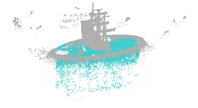
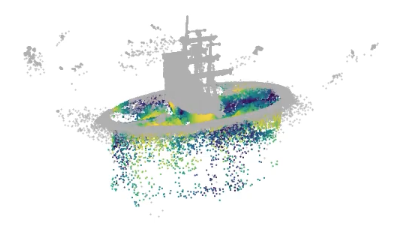

# Phys-GS Lite: Material-Aware Dynamic Gaussian Splatting

[📄 Write Up (PDF)](docs/PhysGSLite.pdf) 

Colab: https://colab.research.google.com/drive/1H4W0Vh6wYCmhd1Xvh-wVvu6X61JiLKhP?usp=sharing

[🌐 Project Website](https://tarungangadhar.github.io/PhysGSLiteWebsite/)  

---

## Abstract
Phys-GS Lite is a lightweight prototype that augments **3D Gaussian Splatting (3DGS)** with **semantic separation and physics-inspired dynamics**. Using simple geometry-driven heuristics, the method distinguishes between rigid and deformable regions (e.g., ship vs water). A sinusoidal wind field introduces wave-like deformation, while graph Laplacian smoothing ensures coherent motion.  

Unlike heavy neural pipelines, this approach is **lightweight, interpretable, and Colab-friendly**, showing that even simple physical cues can extend Gaussian Splatting towards dynamic, material-aware scenes.

---

## Method Overview
- **Semantic Labeling:** geometry heuristics (radial/z-thresholds + hull exclusion) to separate rigid vs deformable splats.  
- **Wind Deformation:** sinusoidal displacement modulated by vertical position.  
- **Laplacian Smoothing:** ensures spatially coherent wave-like motion.  
- **Visualization:** semantic view, close-up, orbit, and heatmap motion intensity.  

---

## Results
- Rigid structures (ship) remain static.  
- Water splats oscillate with realistic ripples.  
- Heatmaps show displacement intensity varies spatially.  
- Achieves visually convincing dynamics with **no fluid solver**.  

| Semantic View | Heatmap Motion |
|---------------|----------------|
|  |  |

---

